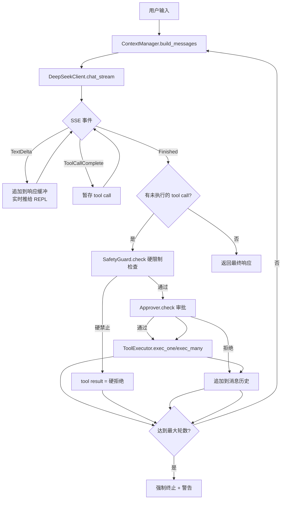

# dsHns — DeepSeek 编程助手（CLI Agent）设计文档

> 状态：待审批 | 日期：2026-06-25

## 一、项目概述

### 1.1 目标

实现一个类似 Claude Code 的命令行 AI 编程助手，底层对接 DeepSeek API。

### 1.2 技术决策总览

| 维度 | 选择 |
|------|------|
| 语言 | Rust（纯后端，无前端） |
| API 接入 | 直接 HTTP + reqwest 手写 DeepSeek API 调用 |
| 工具体系 | 混合模式：内置高频工具 + MCP 扩展点 |
| 交互界面 | 增强 REPL（rustyline） |
| 存储 | 纯文件（JSON/Markdown），根目录 `~/.dsHns_rs/` |
| Agent 循环 | 流式（SSE 边收边执行 tool call） |
| MVP 工具 | read_file / write_file / exec_shell / search_code（4 个） |
| 项目结构 | Cargo workspace 多 crate |
| 架构模式 | 事件驱动管道 |
| 默认模型 | `deepseek-v4-flash` |
| API Key | 环境变量 `DEEPSEEK_API_KEY` |
| API 文档 | https://api-docs.deepseek.com/zh-cn/ |

---

## 二、Cargo Workspace 结构

```
dshns/
├── Cargo.toml                  # workspace root
├── crates/
│   ├── core/                   # 领域模型 + 共享类型
│   │   └── src/
│   │       ├── message.rs      # UserMessage, AssistantMessage, ToolCall, ToolResult
│   │       ├── session.rs      # Session, SessionId, SessionMeta
│   │       ├── tool.rs         # ToolDef, ToolParam, ToolCall, ToolOutcome
│   │       ├── config.rs       # AppConfig, DeepSeekConfig, ContextConfig, ApprovalMode
│   │       ├── event.rs        # AgentEvent 枚举（流式事件）
│   │       └── error.rs        # DshnsError 分层错误类型
│   │
│   ├── deepseek-client/        # DeepSeek API 客户端
│   │   └── src/
│   │       ├── client.rs       # HTTP client, SSE 流式解析
│   │       ├── request.rs      # ChatCompletion 请求构建
│   │       └── response.rs     # 响应/流式 chunk 解析
│   │
│   ├── tools/                  # 工具系统
│   │   └── src/
│   │       ├── registry.rs     # ToolRegistry（注册 + 查找）
│   │       ├── executor.rs     # ToolExecutor（带超时、截断、沙箱）
│   │       └── builtin/
│   │           ├── mod.rs
│   │           ├── read_file.rs
│   │           ├── write_file.rs
│   │           ├── exec_shell.rs
│   │           └── search_code.rs
│   │
│   ├── agent/                  # Agent 循环核心
│   │   └── src/
│   │       ├── loop.rs         # AgentLoop（事件管道主循环）
│   │       ├── context.rs      # ContextManager（消息组装 + 上下文压缩）
│   │       ├── safety.rs       # SafetyGuard（硬限制，不可绕过）
│   │       └── approval.rs     # Approver（软审批模式）
│   │
│   ├── session-store/          # 会话持久化 + 记忆
│   │   └── src/
│   │       ├── store.rs        # SessionStore（读写 ~/.dsHns_rs/sessions/）
│   │       ├── memory.rs       # MemoryStore（Markdown 记忆文件）
│   │       └── context.rs      # PromptLoader（AGENTS.md 加载）
│   │
│   └── app/                    # CLI 入口 + REPL
│       └── src/
│           ├── main.rs         # 入口
│           ├── cli.rs          # clap 命令定义
│           └── repl.rs         # rustyline REPL 循环
│
├── tests/                      # 集成测试
└── README.md
```

### 依赖关系

```
app → agent → deepseek-client
  │      │
  │      ├── tools → core
  │      └── session-store → core
  │
  └── clap, rustyline, tokio
```

**`core` 是所有 crate 的唯一公共依赖，禁止循环依赖。**

---

## 三、DeepSeek Client 设计

### 3.1 核心接口

```rust
pub struct DeepSeekClient {
    http: reqwest::Client,
    api_key: String,
    base_url: String,  // 默认 "https://api.deepseek.com"
}

impl DeepSeekClient {
    pub fn new(config: DeepSeekConfig) -> Result<Self>;
    /// 非流式请求
    pub async fn chat(&self, req: &ChatRequest) -> Result<ChatResponse>;
    /// 流式请求：返回 SSE 事件流
    pub async fn chat_stream(&self, req: &ChatRequest)
        -> Result<impl Stream<Item = Result<StreamEvent>>>;
}
```

### 3.2 SSE 流式事件

```rust
pub enum StreamEvent {
    TextDelta { delta: String },           // 文本增量
    ToolCallStart { id: String, name: String },
    ToolCallArgDelta { id: String, delta: String },
    ToolCallComplete { id: String, name: String, arguments: serde_json::Value },
    Finished { finish_reason: String, usage: Usage },
    Error { message: String },
}
```

### 3.3 请求结构

```rust
pub struct ChatRequest {
    pub model: String,            // "deepseek-v4-flash"（默认）
    pub messages: Vec<Message>,   // 完整对话历史
    pub tools: Option<Vec<ToolDef>>,
    pub stream: bool,
    pub temperature: Option<f32>,
    pub max_tokens: Option<u32>,
}
```

### 3.4 错误处理

| 错误 | 处理 |
|------|------|
| 401 Auth | 退出并提示检查 API Key |
| 429 Rate Limit | 指数退避重试（1s→2s→4s，最多 3 次） |
| 5xx Server | 重试最多 2 次 |
| Network | 提示用户检查网络，可重试 |
| SSE Parse | 记录并跳过该 chunk |

---

## 四、工具体系设计

### 4.1 Tool trait

```rust
#[async_trait]
pub trait Tool: Send + Sync {
    fn definition(&self) -> ToolDef;                    // 工具定义（发给 API）
    async fn execute(&self, call: &ToolCall) -> ToolOutcome;  // 执行工具
}
```

### 4.2 ToolRegistry

统一的注册/查找/导出机制。所有工具以 `Arc<dyn Tool>` 形式注册，MCP 工具通过适配器实现同一个 trait，执行层无感知。

### 4.3 MVP 四个内置工具

| 工具 | 功能 | 关键参数 |
|------|------|---------|
| `read_file` | 读取文件内容 | path, offset(可选), limit(可选) |
| `write_file` | 写入/覆盖文件（UTF-8 编码） | path, content |
| `exec_shell` | 执行 PowerShell 命令（Windows） | cmd, cwd(可选) |
| `search_code` | 代码搜索（调 ripgrep） | pattern, path(可选), glob(可选) |

### 4.4 exec_shell 环境说明

- **Shell**：PowerShell（`powershell.exe -NoProfile -Command ...`）
- **编码**：代码页 65001（UTF-8），即执行前自动 `chcp 65001`
- **平台**：Windows

**命令包装方式：**

```rust
// exec_shell 内部
let wrapped_cmd = format!(
    "chcp 65001 > $null; {}",
    user_cmd
);
let output = Command::new("powershell.exe")
    .args(["-NoProfile", "-Command", &wrapped_cmd])
    .output()
    .await?;
```

### 4.5 exec_shell 安全硬限制

以下命令**硬性拒绝，不弹出审批对话框，直接返回错误给大模型**：

| 禁止命令/模式 | 返回给模型的错误信息 |
|--------------|-------------------|
| `rm -rf` / `rm -r -f` / `Remove-Item -Recurse -Force` | "递归强制删除已被系统禁止。请使用 `Remove-Item <具体文件路径>` 逐个删除文件。" |
| `sudo` / `su` / `runas` | "提权操作已被系统禁止。" |
| `mkfs.*` / `format-*` / `dd` | "磁盘格式化/覆写已被系统禁止。" |
| fork bomb / 无限递归 | "系统资源滥用已被系统禁止。" |
| `del /f /s /q C:\*` / `rd /s /q C:\*` | "递归强制删除已被系统禁止。请逐个指定文件路径。" |

**删除文件行为（PowerShell）：**
- `Remove-Item <单个文件>` — 允许（受审批模式控制）
- `Remove-Item -Recurse <目录>` — 允许但需逐项确认（受审批模式控制）
- `Remove-Item -Recurse -Force <任意路径>` — **硬拒绝**，不弹审批，直接返回错误
- `del <单个文件>` — 允许（受审批模式控制）
- `del /f /s /q <路径>` — **硬拒绝**

**核心原则：** 强制删除（`-Force`/`/f`）加递归（`-Recurse`/`/s`）组合在任何情况下都硬拒绝，不走审批流程，直接告诉大模型换方案。

### 4.6 write_file 编码

所有 `write_file` 操作以 **UTF-8（无 BOM）** 编码写入文件。

### 4.7 提示词层面约束

全局 AGENTS.md 模板中默认包含以下规则：

```markdown
## 环境

- 操作系统：Windows
- Shell：PowerShell（powershell.exe -NoProfile）
- 编码：UTF-8（代码页 65001）
- 文件写入编码：UTF-8 无 BOM

## 安全限制（不可违反）

- 禁止使用 `Remove-Item -Recurse -Force`、`del /f /s` 等递归强制删除命令
- 需要删除文件时，必须使用 `Remove-Item <具体文件路径>` 逐个删除
- 禁止使用 `runas` 等提权命令
- 禁止对系统目录（C:\Windows、C:\Program Files 等）进行写操作
- 禁止下载并直接执行未经用户审查的脚本
- exec_shell 执行前应确认命令的安全性
```

### 4.5 工具结果截断

单次工具结果超过 `max_tool_result_tokens`（配置项，默认 8000 tokens）时，截断为"头 40% + 尾 50% + 省略标记"。

---

## 五、Agent 循环设计

### 5.1 整体流程



### 5.2 核心类型

```rust
pub struct AgentLoop {
    client: Arc<DeepSeekClient>,
    executor: Arc<ToolExecutor>,
    config: AgentConfig,
    context_manager: ContextManager,
    safety_guard: SafetyGuard,  // 硬限制（不可绕过）
    approver: Approver,        // 软限制（审批模式）
}
```

### 5.3 配置参数

```toml
[agent]
model = "deepseek-v4-flash"
max_tool_rounds = 25
tool_timeout_secs = 60
temperature = 0.0
max_tokens_per_request = 8192
request_timeout_secs = 120
```

### 5.4 中断与取消

- **Ctrl+C**：中断当前 Agent 循环，保留会话状态，回到 REPL 提示符
- **连续工具失败 ≥ 5 次**：主动终止当前轮次并告知用户

---

## 六、AgentEvent 事件流

```rust
pub enum AgentEvent {
    UserInput(String),                        // 用户刚提交
    Thinking(String),                         // 流式文本增量
    ToolCallStart { id: String, name: String },
    ToolBlocked { call: ToolCall, reason: String },  // 硬限制拒绝
    ToolExecution { call_id: String, status: ToolStatus, summary: String },
    ToolConfirmationNeeded { call: ToolCall, reason: String },  // 需用户确认
    TurnComplete { usage: Usage, tool_rounds: u32 },
    SessionComplete,
    Error(String),
}
```

REPL 通过 `tokio::mpsc::unbounded_channel` 接收事件流，实时渲染到终端。

---

## 七、CLI & REPL 交互

### 7.1 CLI 命令

```
dshns [OPTIONS] [PROMPT]

选项：
  -p, --prompt <PROMPT>       一次性输入（非交互模式）
  -c, --continue              恢复最近会话
  -m, --model <MODEL>         指定模型
  -d, --dir <DIR>             指定工作目录
  --sessions                  列出历史会话
  --resume <ID>               恢复指定会话
  -o, --output <FORMAT>       输出格式：text（默认）或 json
  -v, --verbose               详细模式
```

### 7.2 REPL 特殊命令

| 命令 | 功能 |
|------|------|
| `/help`, `/h` | 显示帮助 |
| `/exit`, `/e` | 退出程序 |
| `/clear` | 清屏 |
| `/sessions` | 列出历史会话 |
| `/resume <id>` | 切换会话 |
| `/memory` | 列出记忆 |
| `/mode` | 查看当前审批模式 |
| `/mode <auto\|confirm\|paranoid>` | 切换审批模式 |

### 7.3 启动流程

```
dshns 启动
  → 解析 CLI 参数
  → 检查 ~/.dsHns_rs/settings.toml（不存在则创建默认值）
  → 读 DEEPSEEK_API_KEY 环境变量（不存在则报错退出）
  → 加载 AGENTS.md（全局 ~/.dsHns_rs/AGENTS.md + 本地 ./AGENTS.md）
  → 初始化各组件
  → 一次性模式：执行并退出 | REPL 模式：进入交互循环
```

---

## 八、配置与持久化

### 8.1 目录结构

```
~/.dsHns_rs/
├── settings.toml        # 全局配置（自动创建默认值）
├── AGENTS.md            # 全局系统提示词（自动创建默认模板）
├── .history             # rustyline 命令历史
├── memory/              # 持久化记忆
│   ├── MEMORY.md        # 记忆索引
│   └── <name>.md        # 单个记忆
├── sessions/
│   └── <session-uuid>/
│       ├── meta.json    # 会话元信息
│       └── messages.jsonl  # 消息历史
└── logs/
```

### 8.2 settings.toml 完整结构

```toml
[api]
model = "deepseek-v4-flash"
temperature = 0.0
max_tokens_per_request = 8192
request_timeout_secs = 120

[agent]
max_tool_rounds = 25
tool_timeout_secs = 60

[context]
max_window_tokens = 131072        # DeepSeek V4 = 128K
compression_threshold = 0.75      # 75% 触发压缩
max_tool_result_tokens = 8000     # 单工具结果最大 tokens
reserve_tokens = 4096

[mode]
default = "auto"                  # auto | confirm | paranoid
```

### 8.3 系统提示词加载优先级

1. 全局 `~/.dsHns_rs/AGENTS.md`（必须存在，不存在则创建默认模板）
2. 工作目录 `./AGENTS.md`（可选，存在则追加到全局之后）

最终 system message = 全局 + 项目级（如有）拼接。

### 8.4 会话存储

- `meta.json`：会话元信息（ID、标题、时间、消息数、工作目录）
- `messages.jsonl`：每行一条消息的 JSON，支持追加写入、流式读取

---

## 九、上下文压缩策略

### 9.1 三阶段策略

| 阶段 | 触发条件 | 处理 |
|------|---------|------|
| 阶段一：源头截断 | 每次工具返回后 | 单结果超过 `max_tool_result_tokens` → 头尾保留，中间截断 |
| 阶段二：阈值压缩 | 总 tokens > 窗口 * 75% | 裁剪历史：system + 最近 N 轮完整，老 Tool 消息截断，老对话删 Assistant 回复 |
| 阶段三：紧急抢救 | 总 tokens > 窗口 * 95% | 激进裁切：仅保留 system + 最近 2 轮 + 当前输入 |

### 9.2 截断格式

```
[前 3000 tokens 原文]
...
[... 44000 tokens 已省略 ...]
...
[后 5000 tokens 原文]
```

### 9.3 上下文状态展示（verbose 模式）

```
[tokens: 3.2K/128K (2.5%) | 工具: 1轮 | 上下文: 健康]
[tokens: 98K/128K (76%) | 工具: 12轮 | 上下文: 已压缩 ⚠]
[tokens: 125K/128K (97%) | 工具: 20轮 | 上下文: 紧急 ⛔]
```

---

## 十、工具调用策略

### 10.1 双层安全检查

所有工具调用前经过两层检查，**先硬后软**：

```
ToolCall 到来
  → SafetyGuard.check（硬限制，不可绕过）
    → 命中禁止列表 → 硬拒绝（tool result 返回错误信息）
    → 通过
  → Approver.check（软限制，审批模式控制）
    → auto: 直接放行
    → confirm: 危险操作需用户确认
    → paranoid: 全部需用户确认
```

### 10.2 硬限制列表（SafetyGuard）

以下命令**在任何模式下均硬性拒绝**，错误信息反馈给模型，让模型换方案：

| 禁止模式 | 返回给模型的错误 |
|---------|-----------------|
| `Remove-Item -Recurse -Force` / `rd -Recurse -Force` | "递归强制删除已被系统禁止。请使用 `Remove-Item <具体文件路径>` 逐个删除。" |
| `del /f /s /q` / `rd /s /q` | "递归强制删除已被系统禁止。请逐个指定文件路径。" |
| `runas` / 提权操作 | "提权操作已被系统禁止。" |
| `format-*` / `diskpart` | "磁盘操作已被系统禁止。" |
| fork bomb / 无限递归 | "系统资源滥用已被系统禁止。" |

**关键：** 以上全部**不弹审批对话框**，SafetyGuard 直接拦截并返回错误给大模型。

### 10.3 Tool Choice

MVP 全部使用 `Auto`（模型自主决定是否调用工具）。

### 10.4 并行执行

当模型在同一 response 中返回多个 tool_call 时，MVP 默认全部并行执行（`tokio::join!`）。

### 10.5 连续失败保护

- 硬拒绝不计入失败次数（告诉模型换方案是正常流程）
- 执行失败（ToolStatus::Error）连续 ≥ 5 次时，主动终止当前轮次

### 10.6 工具结果注入格式

- 成功：`"工具 <name> 执行成功：\n<content>"`
- 失败：`"工具 <name> 执行失败：<reason>"`
- 超时：`"工具 <name> 执行超时（<timeout>s），请尝试其他方式"`
- 硬拒绝：`"<name> 已被系统禁止：<reason>。请使用其他方式。"`
- 用户拒绝：`"用户拒绝了此操作"`

---

## 十一、审批模式系统

### 11.1 硬限制 vs 软限制

| 类型 | 机制 | 可配置 | 可绕过 |
|------|------|--------|--------|
| 硬限制（SafetyGuard） | 系统级，代码写死 | 否 | 否 |
| 软限制（Approver） | 审批模式控制 | 是（settings.toml + /mode） | 是（换模式即可） |

### 11.2 三种软审批模式

| 模式 | 配置值 | 行为 |
|------|--------|------|
| 全自动 | `auto` | 所有工具直接执行（硬限制仍生效） |
| 危险确认 | `confirm` | 危险命令需确认，安全操作直接放行 |
| 全确认 | `paranoid` | 所有工具调用都需要用户确认 |

### 11.3 危险命令判定（confirm 模式）

以下模式触发审批确认（硬限制列表之外的危险操作）：

- `Remove-Item <文件>`（单个删除需确认）
- `Remove-Item -Recurse <目录>`（递归删除需确认，不含 -Force）
- 任何写入 `C:\Windows\`、`C:\Program Files\`、`C:\Program Files (x86)\` 的操作
- `Invoke-WebRequest ... | Invoke-Expression`（下载并执行需确认）
- 任何访问外网 IP 的网络请求（非已知 API 域名）

### 11.4 模式切换

```toml
# settings.toml 中配置默认值
[mode]
default = "auto"
```

```
# REPL 中运行时切换
/mode           # 查看当前模式
/mode auto      # 切到全自动
/mode confirm   # 切到危险确认
/mode paranoid  # 切到全确认
```

### 11.3 确认交互

```
> 帮我清理临时文件

  🔧 exec_shell: "rm -rf /tmp/build_*"
  ⚠ 危险操作，是否执行？[y/n] y

  ✓ 执行成功，12个文件已删除
```

---

## 十二、错误处理

### 12.1 错误分层

| 层 | 错误类型 | 恢复方式 |
|----|---------|---------|
| 配置 | NoApiKey, InvalidSettings | 退出，提示修正 |
| API | Auth(401), RateLimit(429), Server(5xx), Network, Parse | 自动重试 / 退出 |
| 工具 | FileNotFound, PermissionDenied, ShellNonZero, Timeout | 错误结果反馈给模型 |
| 会话 | NotFound, Corrupted, WriteFailed | 提示并跳过 |
| Agent | ContextOverflow, ToolLoopStuck | 自动压缩 / 终止 |

### 12.2 终端输出原则

- 默认显示简洁错误信息，无堆栈
- `--verbose` 模式显示完整错误链
- Ctrl+C 中断 Agent 循环，保留会话，回到 REPL

---

## 十三、测试策略

### 13.1 分层测试

| crate | 测试类型 | 测试内容 |
|-------|---------|---------|
| `core` | 单元测试 | 消息序列化、ToolDef JSON Schema 格式 |
| `deepseek-client` | 集成测试 (mock HTTP) | SSE 解析、429 重试 |
| `tools` | 单元 + 集成 | 边界条件（空文件/大文件）、超时、ripgrep 匹配 |
| `agent` | 行为测试 (mock client) | 无工具对话、多轮工具、最大轮数限制、取消令牌 |
| `session-store` | 集成测试 (临时目录) | 创建/加载/列表、损坏文件处理 |
| `app` | 端到端 | 文本输入/回复、工具调用 |

### 13.2 测试工具

- `tokio-test`：异步测试运行时
- `wiremock`：Mock HTTP server
- `tempfile`：临时目录
- `pretty_assertions`：可读断言

---

## 十四、后续扩展（MVP 后）

- MCP 协议适配器（`McpToolAdapter`）
- Meta Loop（分析 → 编排 → 校验 → 迭代）
- LLM 摘要式上下文压缩
- 记忆搜索与自动召回
- 多模态支持（图片输入）
- 插件系统
- 远程会话

---

## 十五、参考

- DeepSeek API 文档：https://api-docs.deepseek.com/zh-cn/
- Claude Code 架构参考：事件驱动管道 + 工具混合模式
